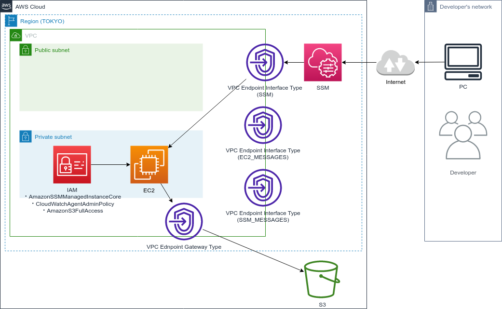

# aws-cdk-private-subnet-ec2-and-s3-goofys

## 構成図



## SSH アクセス

```bash
EC2_INSTANCE_ID=$(aws ec2 describe-instances \
    --filters "Name=tag:Name,Values=AwsCdkTemplate-AwsCdkTemplateStack/AwsCdkTemplate-AwsCdkTemplateStack-general_purpose_ec2" \
    --query "Reservations[].Instances[?State.Name=='running'].InstanceId[]" \
    --output text)
ssh -i ~/.ssh/ec2/id_ed25519 admis@$EC2_INSTANCE_ID
```

## S3 との疎通確認

- AWS CLI でアクセスする場合
  ※ `~/.aws/config` に region を指定していない場合は，`--region` フラグで明示的にリージョン指定する必要がある
  ```bash
  aws s3 --region ap-northeast-1 ls
  aws s3 --region ap-northeast-1 ls s3://test-private-2023-0511
  ```
- curl でアクセスする場合
  ```bash
  $ curl https://[ BUCKET_NAME ].s3.ap-northeast-1.amazonaws.com/test.txt
  $ curl https://test-private-2023-0511.s3.ap-northeast-1.amazonaws.com/test.txt
  ```

## 認証情報の確認

```bash
aws configure list
```
※ プロキシ経由で AWS CLI を使用する場合は，環境変数に `no_proxy=169.254.169.254` の設定が必要な場合がある．
AWS CLI はインスタンスメタデータを `169.254.169.254` から取得している．`169.254.169.254` は EC2 からの直接通信でのみアクセスできる AWS のシステムのアドレスである．
OS 側でプロキシを設定している場合，AWS CLI は EC2 に割り当てた IAM role の認証情報を，プロキシ経由で取得しようとするため，システムから読み込めず，None と表示される．

- [AWS CLIでプロキシサーバを使う場合の注意](https://dev.classmethod.jp/articles/aws-cli-iamrole/)
- [プロキシに阻まれながらAWS CLIをEC2インスタンスから動かしたときの話](https://qiita.com/izey0306/items/77bcbb79be1ede95fe6c)

## goofys のインストール

順番にインストールして設定する

## fuse

fuse は goofys が使用するパッケージ

```bash
sudo yum install -y fuse
```

### goofys

※先にfuseをインストールしておく

```bash
sudo curl -L https://github.com/kahing/goofys/releases/latest/download/goofys -o /usr/local/bin/goofys
sudo chmod a+x /usr/local/bin/goofys
```

```bash
goofys --version
```

### goofys で S3 のマウント

`test-2023-0511` バケットを S3 に作成しておく．

```bash
mkdir test-2023-0511-bucket
goofys --region=ap-northeast-1 test-2023-0511 $HOME/test-2023-0511-bucket
```
※ `--region=ap-northeast-1` を付けないと，Gateway 型の S3 Endpoint 経由でなく，NAT Instance 経由で通信するため，NAT Instance を停止させた場合にマウントできない．

マウント状況の確認
```bash
$ df -h
ファイルシス   サイズ  使用  残り 使用% マウント位置
devtmpfs         215M   68K  215M    1% /dev
tmpfs            226M     0  226M    0% /dev/shm
/dev/nvme0n1p1   7.8G  1.2G  6.6G   16% /
test-2023-0511   1.0P     0  1.0P    0% /home/admis/test-2023-0511-bucket
```

失敗した場合は，エラーログを見る
```bash
sudo cat /var/log/messages # Amazon Linux 2
sudo cat /var/log/syslog # Ubuntu
```

なお，永続化する場合は，下記の要領らしい．（未検証）
```bash
$ cat /etc/fstab
/root/go/bin/goofys#testbucket /mnt/testbucket fuse _netdev,allow_other,--dir-mode=0775,--file-mode=0666,--uid=1000,--gid=1000,--region=ap-northeast-1 0 0

> Ref: [VPCエンドポイントでS3にアクセスする場合のgoofys利用で気を付けておきたいこと](https://dev.classmethod.jp/articles/20190208-goofys/)
```

### 参考資料

- [EC2＋goofysでS3バケットをマウントしたい](https://qiita.com/0xmks/items/f1d325ce2de6a805c6f7)

## cloud-init のログを確認する

```bash
sudo cat /var/log/cloud-init-output.log
```

---

## 参考情報

### CDK で EC2 に IAM Role を割り当てる

1. CfnInstance で EC2 を作成する場合
   `EC2InstanceRole.create()` で role を作成して，CfnInstanceProfile を通した後，CfnInstance に渡す（らしい）．
  - [AWS CDKでEC2にIAMロールを割り当てる時の覚書](https://wp-kyoto.net/add-iam-role-to-ec2-instance-by-aws-cdk/)
2. ec2.Instance で EC2 を作成する場合
   ソースコード参照

## Ubuntu の自動アップデート

- [大切なことはすべてUbuntuが教えてくれた　無人アップグレードを知りましょう](https://qiita.com/Brutus/items/b264384361d08b7475f6)

---

## 付録

### よく使うコマンド

#### プロジェクトの初期化

```bash
$ mkdir cdk-workshop && cd cdk-workshop
$ cdk init sample-app --language typescript
```

#### テスト
```bash
npx npm run test
```
```bash
npx npm run test -- -u
```

#### デプロイ
```bash
npx cdk synth
```
```bash
npx cdk deploy --all --require-approval never
```
```bash
npx cdk destroy --all --force
```
